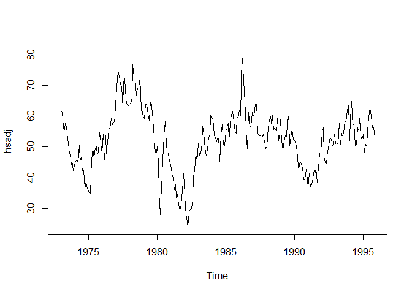
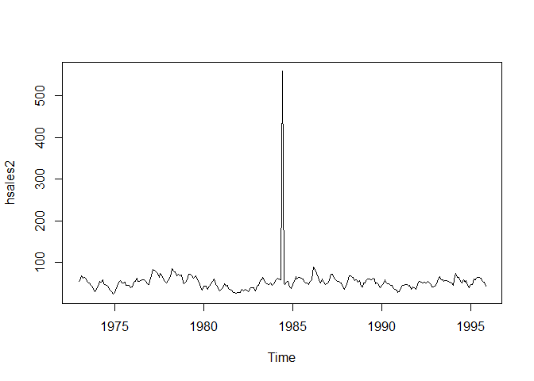
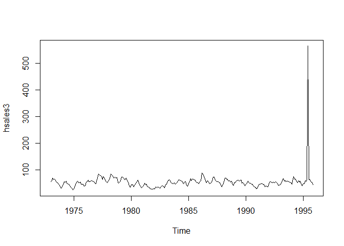
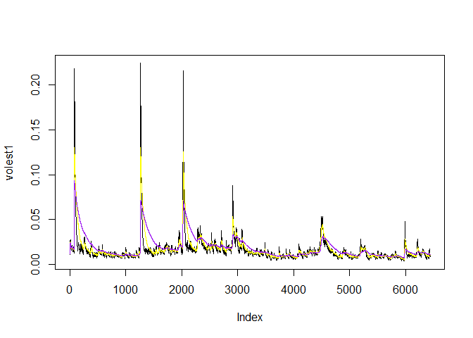

# Volatility Flactuations
MessaA  
July 24, 2016  
## Q1. hsales data  
### a. Download and plot hsales data. Can you identify seosonal flactuation or trend?

```r
library(fpp) #fpp package needed to be installed
```

```
## Warning: package 'fpp' was built under R version 3.3.1
```

```
## Loading required package: forecast
```

```
## Warning: package 'forecast' was built under R version 3.3.1
```

```
## Loading required package: zoo
```

```
## 
## Attaching package: 'zoo'
```

```
## The following objects are masked from 'package:base':
## 
##     as.Date, as.Date.numeric
```

```
## Loading required package: timeDate
```

```
## This is forecast 7.1
```

```
## Loading required package: fma
```

```
## Warning: package 'fma' was built under R version 3.3.1
```

```
## Loading required package: tseries
```

```
## Warning: package 'tseries' was built under R version 3.3.1
```

```
## Loading required package: expsmooth
```

```
## Warning: package 'expsmooth' was built under R version 3.3.1
```

```
## Loading required package: lmtest
```

```r
data(hsales)
plot(hsales)
```

<!-- -->

#### It looks like there are both seasonal and trend fluctuations

### b. Use classical decomposition to calculate the trend-cycle and seosonal indices.Do the results support the graphical interpretation from part(a)?  

```r
fithsd <- decompose(hsales)
plot(fithsd)
```

<!-- -->

#### Yes they do, the decomposition clearly shows all that fluctuations (seasonal and trend)

### c. compute and plot the seasonally adjusted data.

```r
hsadj <- seasadj(fithsd)
plot(hsadj)
```

<!-- -->

### d. change one observation to be an outlier  (say 500) and recompute the the seasonally adjusted data. What is the effect of the outlier?  

```r
hsales2 <- ts(c(hsales[1:137],hsales[138]+500,hsales[139:275]),start=c(1973,1),frequency=12)
plot(hsales2)
```

<!-- -->

#### The outlier causes the house sales to have a sharp change at the middle where the outlier is added at. 

### e. does it make any diffrence if the outlier is near end rather than in the middle of the time series?  

```r
hsales3 <- ts(c(hsales[1:269],hsales[270]+500,hsales[271:275]),start=c(1973,1),frequency=12)
plot(hsales3)
```

<!-- -->

#### Yes it does. As the outlier moves towards the end the change (sharp peak) moves with it too

### f. Now use STL to decompose the series  

```r
fit <- stl(hsales, s.window=5)
plot(fit)
```

<!-- -->

## Q2. Volatility Analysis  

### a. download the data  

```r
library(tseries)
ADPdata <- get.hist.quote('ADP',quote="Close")
```

```
## time series ends   2016-07-22
```

```r
length(ADPdata)
```

```
## [1] 6440
```
### b. calculate log returns  

```r
ADPret <- log(lag(ADPdata)) - log(ADPdata)
length(ADPret)
```

```
## [1] 6439
```
### c. calculate volatility measure   

```r
ADPvol <- sd(ADPret) * sqrt(250) * 100
ADPvol
```

```
## [1] 34.48085
```
### d. calculate volatility measure with continous lookback window  

```r
get
```

```
## function (x, pos = -1L, envir = as.environment(pos), mode = "any", 
##     inherits = TRUE) 
## .Internal(get(x, envir, mode, inherits))
## <bytecode: 0x0000000012e06558>
## <environment: namespace:base>
```

```r
Vol <- function(d, logrets)
{
var = 0
lam = 0
varlist <- c()
for (r in logrets) {
lam = lam*(1 - 1/d) + 1
	var = (1 - 1/lam)*var + (1/lam)*r^2
	varlist <- c(varlist, var)
	}
sqrt(varlist)
}
volest1 <- Vol(10,ADPret)
volest2 <- Vol(30,ADPret)
volest3 <- Vol(100,ADPret)
```

### e. plot the results with a volatility curve overlay  

```r
plot(volest1,type="l")
lines(volest2,type="l",col="yellow")
lines(volest3, type = "l", col="purple")
```

<!-- -->

#### The volatility plot shows there is a high risk for the ADP return of weight =10 at arround the beginning, between 1000 and 2000, and between 2000 and 3000 indices. Those risks are getting better and better as the weight increases to 100. 
